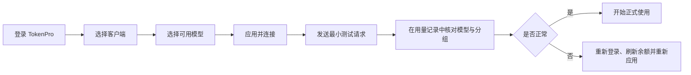

# TokenPro 跨平台桌面客户端

安装包可从仓库的 [GitHub Releases](https://github.com/121882249/TokenPro-Frontend/releases) 页面下载。

TokenPro 现在只有一套 Java 21/Swing 客户端源码，支持 Windows、macOS 和 Linux。macOS 的 Intel 与 Apple 芯片版本、Windows x64 版本和 Linux x64 版本由 GitHub Actions 分别在对应系统构建。

## 使用指南

最新版客户端提供 4 条彼此隔离的接入路径。面向最终用户的图文教程以 [TokenPro 使用文档](https://tokenpro.work/docs) 为准，包含安装检查、模型选择、连接验证、恢复官方配置和常见问题。

| 接入方式 | 配置隔离 | 本地桥接 | 适用场景 |
|---|---|---|---|
| Codex 客户端 | 独立 Codex 配置与认证 | 图片桥接 `127.0.0.1:23180` | 桌面图形界面、对话与生图 |
| Claude 客户端 | 独立 Claude 第三方账户 | `127.0.0.1:23179` | Claude Desktop 图形界面 |
| Codex CLI | 独立 `CODEX_HOME` | 图片桥接 `127.0.0.1:23182` | 终端开发、脚本和 Agent 任务 |
| Claude Code | 独立 `CLAUDE_CONFIG_DIR` | `127.0.0.1:23181` | Claude Code 终端工作流 |



开始前请确认 TokenPro 已更新到 `v1.2.89` 或更高版本。Claude Code 需为 `2.1.242` 或更高版本；Windows 一键连接使用原生 CLI，WSL 环境需要单独配置。

TokenPro 不修改系统全局 PATH，也不会用命令行配置覆盖桌面端配置。直接从普通终端运行原来的 `codex` 或 `claude`，仍使用各自的官方配置。

## 功能

- TokenPro 邮箱密码登录与本机会话恢复。
- 登录后的“我的账户”仅显示账户余额和退出账户操作。
- 从模型广场选择 Codex 模型，自动创建专用 Key、应用配置，并可一键恢复官方配置。
- 通过纯 Java 本地桥接把 TokenPro 模型接入 Claude Desktop，支持模型分组自动切换、工具调用和流式响应。
- API Key 保存在当前系统用户的 TokenPro 私有配置目录，不写入 `config.toml`。
- “我的应用”提供“选择模型 / 恢复官方配置 / 连接客户端”；命令行工具提供下载入口和连接命令行。
- 在 TokenPro 内置浏览器中打开后台管理、使用文档、充值页和版本下载页。
- 启动后自动检查更新并提醒，也可手动检查；支持启动 Codex、Claude、Codex CLI 与 Claude Code。

## 构建

需要 JDK 21。macOS 或 Linux：

```bash
./build.sh
./release.sh
```

Windows PowerShell：

```powershell
./build.ps1
./release.ps1
```

详细的平台目录与打包说明见 [`java-client/README.md`](java-client/README.md)。

## 源码

Java 源码位于 `java-client/src/main/java/work/tokenpro/client/`。入口类是 `work.tokenpro.client.Main`。
