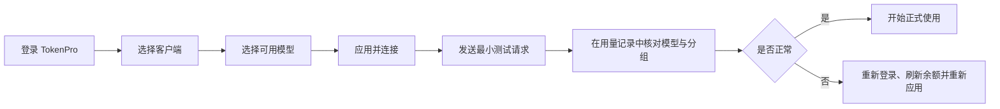

# TokenPro 跨平台桌面客户端

安装包可从仓库的 [GitHub Releases](https://github.com/121882249/TokenPro-Frontend/releases) 页面下载。

TokenPro 现在只有一套 Java 21/Swing 客户端源码，支持 Windows、macOS 和 Linux。macOS 的 Intel 与 Apple 芯片版本、Windows x64 版本和 Linux x64 版本由 GitHub Actions 分别在对应系统构建。

## v1.3.33 更新

- 点击任一入口的“连接”只启动该入口，不会联动启动或重启另外三个端。
- Codex 客户端与 Codex CLI 继续共用配置和历史，但连接、重启、切换和修复都只作用于当前点击的入口。

## v1.3.32 更新

- 四个入口的启动按钮仅打开对应客户端或命令行，沿用已保存的配置，不再执行渠道切换或联动重启其他入口。
- 未选模型时启动也不会自动切换官方配置；选择模型、切换官方和修复历史继续通过菜单操作。

## v1.3.31 更新

- Codex 客户端与 Codex CLI 改为共用系统默认 `CODEX_HOME`：模型选择、渠道、认证、对话历史及“修复历史对话”使用同一套数据。
- 普通终端直接运行原生 `codex` 即读取 TokenPro 已应用的客户端配置；macOS、Windows、Linux 均无需改 PATH 或 shell / PowerShell 启动文件。命令行卡片复用客户端的切换、回滚和修复流程。
- 因模型目录也共用，客户端选择的生图组会出现在 Codex CLI 的模型列表中；Claude 客户端、Claude Code 仍不导出生图组。

## v1.3.30 更新

- Codex 命令行现在与 Codex 客户端一样提供“修复历史对话”。
- 四个入口继续共用同一套安全切换约束：先停止目标程序，写入并校验目标配置；失败时恢复原配置。

## v1.3.29 更新

- 生图模型严格以服务端分组字段识别：`groupPlatform == openai` 且分组描述去除首尾空白后为“生图”。
- 专用生图组仅显示于 Codex 客户端；Codex CLI、Claude 客户端和 Claude Code 均不会保存或导出该组。
- Codex 客户端、Codex CLI、Claude 客户端与 Claude Code 继续各自使用独立配置目录和模型选择。

## v1.3.6 更新

- 分组平台为 `openai` 且描述为“生图”的分组使用紫蓝青极光框体、同色“余额”标签和带星光渐变的 OpenAI 生图图标。
- 生图分组固定排列在全部订阅分组之后、普通余额分组之前。

## v1.3.5 更新

- “余额”标签的底色、边框和文字也跟随服务器分组平台颜色；“订阅”标签继续保持金色。

## v1.3.4 更新

- 模型选择器按服务器分组平台自动映射框体、标题和平台图标颜色，新平台分组可直接复用平台视觉配置。
- 订阅分组继续使用金色框体与标题，平台图标仍跟随分组平台；模型选中态继续使用原有紫蓝渐变。
- 删除模型选择器右上角重复的关闭按钮，保留“取消”和 ESC 关闭操作。

## v1.3.3 更新

- Windows 通道切换使用非管理员沙箱模式；在同一个 `config.toml` 中更新模型和服务商，保留审批、项目、MCP 等设置，恢复官方不再删除配置文件。
- 客户端云端请求支持系统代理及常用 HTTP 代理环境变量，TLS 握手失败提供中文提示。
- “订阅”按钮直接打开订阅选项卡。
- 保留 v1.3.2 的生图分组路由修复。

## 使用指南

最新版客户端提供 4 条接入路径。Codex 客户端与 Codex CLI 共用一套 Codex 状态；Claude 的桌面端和命令行仍使用各自所需的适配配置。面向最终用户的图文教程以 [TokenPro 使用文档](https://tokenpro.work/docs) 为准，包含安装检查、模型选择、连接验证、恢复官方配置和常见问题。

| 接入方式 | 配置隔离 | 网络路径 | 适用场景 |
|---|---|---|---|
| Codex 客户端 | 独立 Codex 配置与认证 | 直连 `tokenpro.work` | 桌面图形界面、对话与生图 |
| Claude 客户端 | 独立 Claude 第三方账户 | `127.0.0.1:23179` | Claude Desktop 图形界面 |
| Codex CLI | 共用 Codex 客户端的 `CODEX_HOME` | 直连 `tokenpro.work` | 终端开发、脚本和 Agent 任务 |
| Claude Code | 独立 `CLAUDE_CONFIG_DIR` | `127.0.0.1:23181` | Claude Code 终端工作流 |

Codex 的原生图片模式由后端按当前回合的真实分组启用：仅适用于全局 Key、平台为 `openai` 且描述去除首尾空白后等于“生图”的分组。其他分组走普通请求流程；客户端不再在共用 provider 上固定配置 `native-v2`。升级时先部署支持该分组策略的后端，再更新客户端并重新应用连接配置。



开始前请确认 TokenPro 已更新到 `v1.2.93` 或更高版本。Claude Code 需为 `2.1.242` 或更高版本；Windows 一键连接使用原生 CLI，WSL 环境需要单独配置。

TokenPro 不修改系统全局 PATH，也不写 shell 或 PowerShell 启动文件。Codex 客户端与原生 `codex` 命令共用系统默认配置，因此任一入口完成 TokenPro / 官方渠道切换后，另一入口下次启动时会读取同一结果。`claude` 始终保持原生命令。

## 功能

- TokenPro 邮箱密码登录与本机会话恢复。
- 登录后的“我的账户”仅显示账户余额和退出账户操作。
- 从模型广场选择 Codex 模型，自动创建专用 Key、应用配置，并可一键恢复官方配置。
- 通过纯 Java 本地桥接把 TokenPro 模型接入 Claude Desktop，支持模型分组自动切换、工具调用和流式响应。
- Codex 直连时将 TokenPro API Key 写入其独立配置；Claude 的上游 Key 仍只保存在 TokenPro 私有目录。
- “我的应用”提供“选择模型 / 恢复官方配置 / 连接客户端”；命令行工具提供下载入口和连接命令行。
- 在 TokenPro 内置浏览器中打开后台管理、使用文档、充值页和版本下载页。
- 启动后自动检查更新并提醒，也可手动检查；支持启动 Codex、Claude、Codex CLI 与 Claude Code。

## 构建

需要 JDK 21。macOS 或 Linux：

```bash
./build.sh
./release.sh
```

Windows PowerShell：

```powershell
./build.ps1
./release.ps1
```

详细的平台目录与打包说明见 [`java-client/README.md`](java-client/README.md)。

## 源码

Java 源码位于 `java-client/src/main/java/work/tokenpro/client/`。入口类是 `work.tokenpro.client.Main`。
